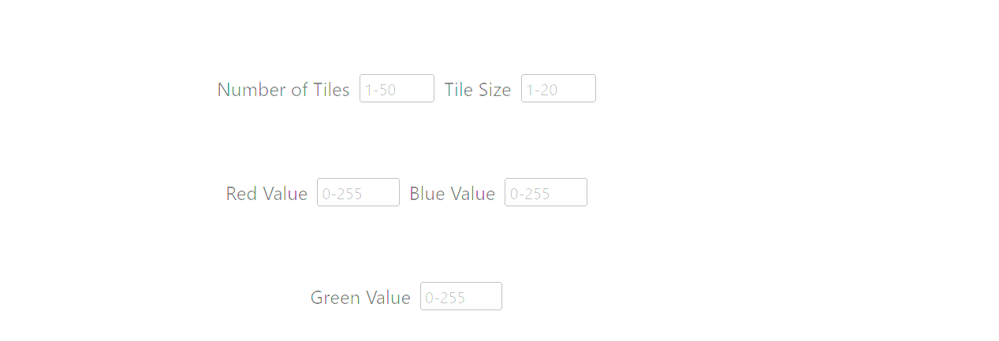
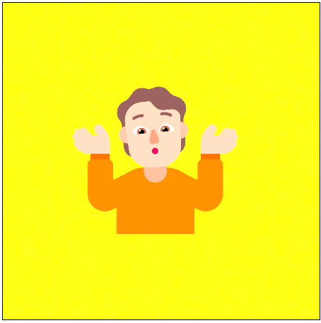

# Emojiboard

## Description

This web app uses parameters input by the user to generate a unique background with a randomly
generated emoji. The box located below the image supplies the link to the background .png file 
and the unicode for the emoji below the image. This web app was designed to be used as a fun 
logo generator. It utilizes the emojihub and php-noise APIs to render the image. The generated 
image data is logged and saved to local storage.

This was our first experience in a group setting. We all learned a great deal in how to operate
together to achieve a common goal. We learned how to utilize the GitHub workflow in a way that we 
had not before and gained a deeper understanding of the branch system. We also had a chance to
explore the Bulma CSS framework.

## Installation

N/A

## Usage

The user inputs the parameters they wish into the generator.

After inputting the desired parameters, the user clicks the "Generate" button.

The result will be a rendered background image based on parameters with a randomly 
generated emoji!

## Credits

EmojiHub Web API by cheatsnake - https://github.com/cheatsnake/emojihub  
PHP Noise Background Image Generator API (Open Source) - https://php-noise.com/  
Bulma CSS Framework (Open Source) - https://bulma.io/

[Zachary Grantz](https://github.com/ZekuzaKeane/) | CSS  
[Luna Joffily](https://github.com/Lujoffily/) | HTML  
[Ryan Caltabiano](https://github.com/Ryan9698/) | JavaScript  
[Elijah Satten](https://github.com/elijahsatten/) JavaScript  

## License

No license was used for this project

## Link

 
